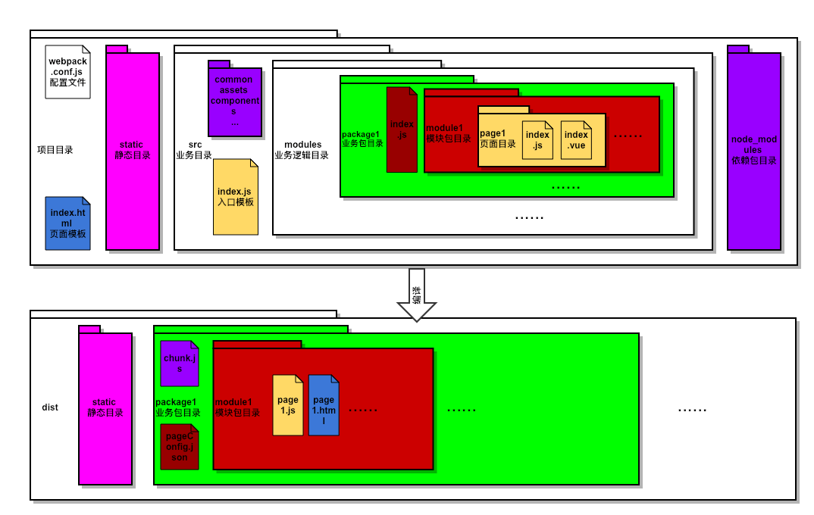

<p align="center">
  
</p>
<p align="center">
  <a href="https://travis-ci.org/Taoja/dividing"></a>
  <a href="https://npmcharts.com/compare/dividing?minimal=true"></a>
  <a href="https://www.npmjs.com/package/dividing"></a>
  <a href="https://github.com/taoja/dividing/releases"></a>
  <a href="https://github.com/taoja/dividing/issues"></a>
  <a href="https://www.npmjs.com/package/dividing"></a>
  <!-- <a href="https://packagephobia.now.sh/result?p=dividing"></a> -->
</p>
dividing是一套基于webpack的脚手架工具集，本工具致力于业务包拆分。

# 特点
[](https://greenkeeper.io/)
+ 多工程化：分包机制让每一个包都有独立的工程环境，让各个包共享同一个资源环境，可独立打包发布，降低发布成本。可独立调试，减少开发成本。
+ 多环境支持：一套代码，多环境运行。通过配置[环境变量](#webpack配置)实现同一套代码不同环境编译效果，加快版本迭代速度。
+ 高拓展性：开放plugins、loader配置，可自行拓展脚本及加载器（默认支持vue、sass）
+ 离线包功能：配合turbo移动开发平台实现字节级的差量更新

# 项目结构

<p align="center">
  
</p>

## webpack.config.js
项目配置文件，详情参见[webpack配置](#webpack配置)

## index.html
入口页面模板，可用于配置静态文件引入、meta信息、全局变量等公共属性

## src/
业务逻辑开发目录（目录缩写默认为‘@’）
+ src/assets/ 公共资源存放目录，业务代码可按需引入其中文件。（目录缩写默认为‘@a’）
+ src/common/ 公共脚本，处理器存放目录。（src/commom/js默认缩写为‘@j’，src/common/scss默认缩写为‘@s’）
+ src/components/ 公共组件存放目录。（目录默认缩写为‘@c’）
+ src/modules/ 离线包存放目录。
+ index.js 入口文件、用来配置vue初始化相关代码
```js
//引入vue
import Vue from 'vue'

//定义初始化模板
const init = (App) => {
  new Vue({
    el: '#entry',
    template: '<App />',
    components: {App}
  })
}

//输出初始化模板给各页面
export default init
```

缩写用法：
```js
// img标签src用法


// css中给背景图赋值
.demo{
  background-image: url('~@a/demo.png');
}

// 引入公共脚本
require('@j/bridge.js');

// 引入公共组件
import button from '@c/button.vue'

```

公共目录缩写配置参见[webpack配置](#webpack配置)

## src/modules/{离线包名}/index.js
配置离线包内生效的模块及页面
```js
module.exports = {
  wel: { // 生效的模块包名
    come: {}, // 生效的页面名
  }
}
```

## src/modules/{离线包名}/{模块包名}/
页面文件夹存放目录

## src/modules/{离线包名}/{模块包名}/{页面名}/
页面相关文件存放目录
+ index.js 入口引用文件、将同目录下index.vue文件初始化
```js
import init from '@/'
import app from './index.vue'
init(app)
```
+ index.vue 页面文件

## static/
公共静态库存放目录，目录内文件通过[index.html模板文件](#index.html)静态引入

需要import转换可配置externals：
```html
<!-- 因编译后入口目录层级加深，引用需要加上'../../' -->
<script src="../../static/vue.min.js"></script>
```
```js
// webpack.config.js中配置
externals: {
  'vue': 'window.Vue',
},
```
# 使用方式

## 安装依赖

```
$ npm run install
```

>推荐使用[cnpm](https://cnpmjs.org/)进行安装

>macos、linux请使用sudo命令获取管理员权限安装


## 本地调试

```
$ npm run dev
```

编译开始提示[选择环境](#环境选择)

## 本地构建

```
$ npm run build
```
编译开始提示[选择环境](#环境选择)

编译完成后会根据[webpack.config.js](#webpack配置)中的配置运行sourcemap整理脚本，将各页面sourcemap文件放入指定文件夹
## 构建zip包

```
$ npm run zips
```
该命令将会把dist下所有目录打包成对应名称的zip文件
## 环境选择

```
$ 请输入运行的环境：
```
该命令会选择[webpack.config.js](#webpack配置)中[default.env](#default)中第一个环境为默认环境。

选中的环境中对应对象将会在所有页面文件中生效

选择完环境后提示[选择离线包](#离线包选择)
## 离线包选择

```
$ 请输入需要打包的模块名，以空格分隔（不输入则全部打包）：
```
src/modules/下的文件夹为离线包名称、输入各离线包名可以实现指定离线包打包功能

# webpack配置
配置文件为根目录下webpack.config.js

## dir
固定设置为_dirname

## static
静态资源输出路径，默认static
+ 固定名称："'name'"
+ 解析名称: "config.default.output + 'static'"

## default
默认配置项，dev、build公共配置属性

+ output - build输出目录，默认为dist
+ chunks - 业务包内公共代码提取
+ resolve - 解析，配置缩写及简写
+ externals - 外部扩展，用于引入静态第三方库
+ env - 环境变量配置，第一个环境为默认环境
+ global - 全局变量配置
+ packageID - 配置业务包id，run zips时根据ID打包为对应ID名的zips文件
+ plugins - webpack插件列表，默认使用vue加载器、打包相关插件无需引入
+ loader - webpack loader列表

## dev
调试模式相关配置
+ port - 实时调试模式监听端口号，默认8082
+ host - 实时调试模式监听ip，默认0.0.0.0 等效于localhost
+ devtool - sourcemap配置
+ open - 实时调试模式开启后自动开启的页面
+ proxy - 用于本地调试时访问跨域接口

## build
编译模式相关配置
+ devtool - sourcemap配置，默认source-map
